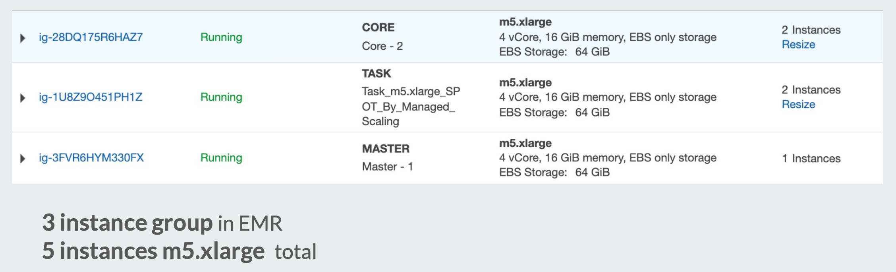
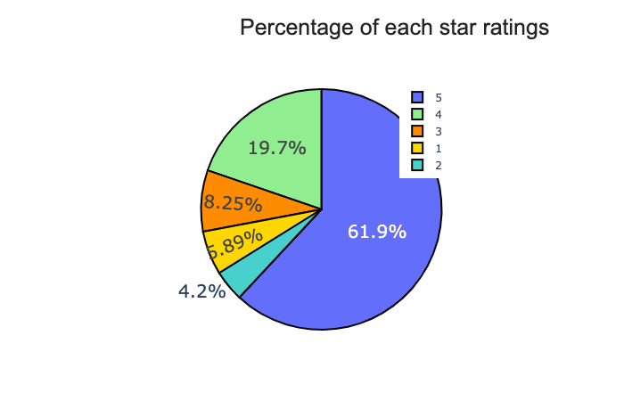
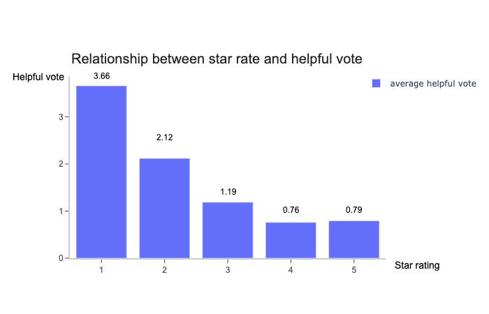
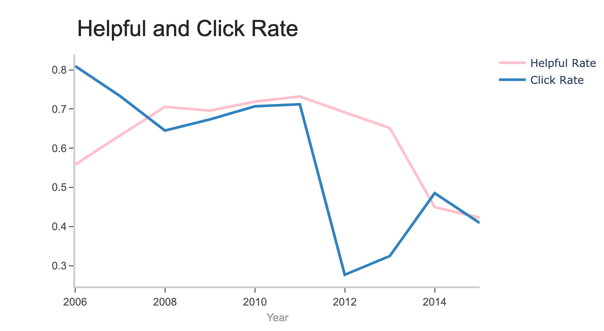
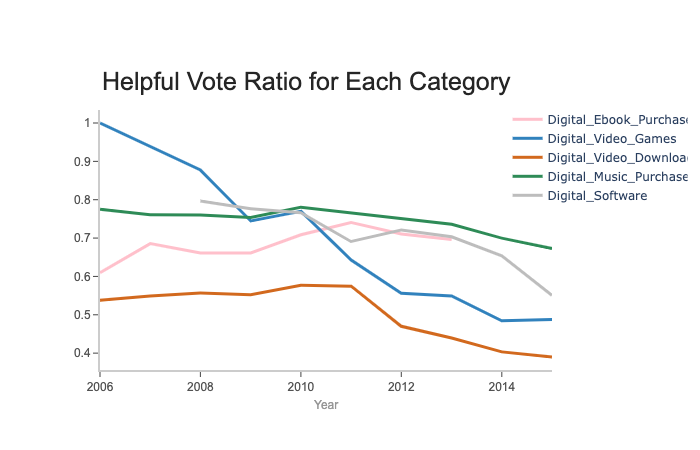
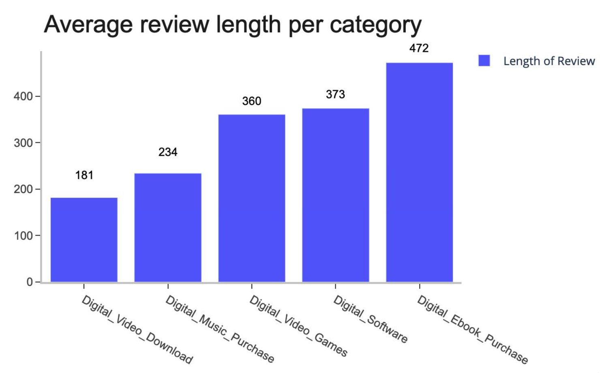
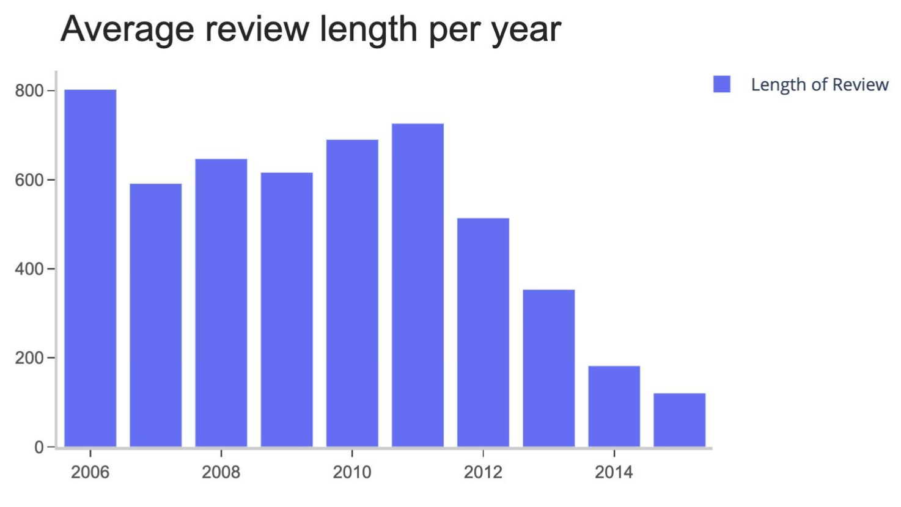
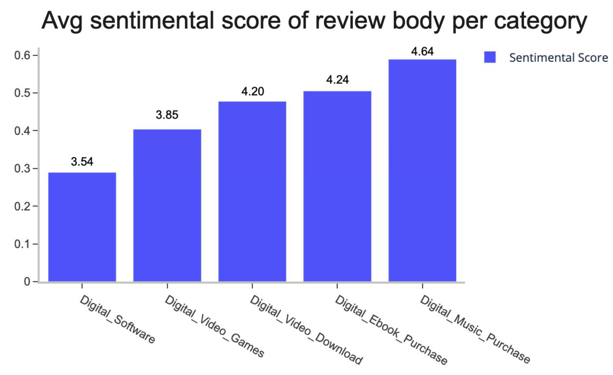

# Amazon Product Analysis
## Intro


This is a project to analyze Amazon's digital product from different perspectives. Our team members are *Zhipeng Hong*(zhong5@usfca.edu), *Wei He*(whe13@usfca.edu), *Kaihang Zhao*(kzhao24@usfca.edu), *Jih-Chin Chen*(jchen217@usfca.edu). This project was done during the University of San Francisco MSDS 2021 fall module.

 In this project, we built pipeline to access data from **AWS S3** and processed data in **AWS EMR**. Then we used **Spark RDD** to analyze **Amazon Digital Products Review** from different dimension. We used 5 instances m5.xlarge in EMR to process our raw data which supported us proccess data more faster.


## Datasets
Our original data have 
* **2.86GB+** in total
* **11,095,239** observations
* **15** relevant columns
* **5** digitalproduct categories.

| Factor | DataType | Detail |
|--------|--------|--------|
| `marketplace` | String | 2 letter country code of the marketplace where the review was written.|
| `customer_id` | Numeric | A identifier that can be used to aggregate reviews written by a single author. |
| `review_id` | Numeric | The unique ID of the review. |
| `product_id` | Numeric | The unique Product ID the review pertains to. In the multilingual dataset the reviews for the same product in different countries can be grouped by the same productid. |
| `product_parent` | Numeric | A identifier that can be used to aggregate reviews for the same product. |
|`product_title` |Text|Title of the product|
|`product_category`|Text|Broad product category that can be used to group reviews|
|`star_rating`|Numeric|The 1-5 star rating of the review.|
|`helpful_votes`|Numeric|Number of helpful votes.|
|`total_votes`|Numeric|Number of total votes the review received.|
|`vine`|Boolean|Review was written as part of the Vine program.|
|`verified_purchase`|Boolean|The review is on a verified purchase.|
|`review_headline`|Text|The title of the review.|
|`review_body`|Text|The review text.|
|`review_date`|Text|The date the review was written.|

## Data Analytics Goal
* Review with other features across category level.
* Review with other features across time level.
* Review with other features across time and category level.
* Review Content and Sentimental Score.

# Produce Analysis
We analyzed our dataset through 4 different perspectives. In order to analyze the review context, we also implemented sentimental analysis. Then we used `Plotly` a visualization tool to plot our graphs.

## Review Count and Star Rating Analysis
### Star Rating Analysis

From review count, we found people are becoming less concentrated on the review. We can analysis this phenomenon from another perspective, which is focusing on the relationship between star rating and review count. Below are the two plots regarding percentage of each star rating and the trend of review count with star rating increasing.

  

These plots show that: 
* Over 80% percent of reviews gave the star rating of 4 or 5. 
* On average there was only 0.76 to 0.79 helpful vote for star rating of 4 and 5. And with the decreasing of the star rating, the average helpful vote became higher. It means, people are more caring about the review which told us the weakness or short comes of the products.

## Ratio Analysis

In this part, we analyzed click rating and helpful rating. Helpful rate is defined as the number of helpful reviews divided by the total number of reviews and click rate is how likely the user will click the rating for the item.
We loaded data using paired-RDD and used `.cache` to persist our data into memory so that we can speed up the processing time. By using `groupByKey`, `map`, and `count` functions, we aggregated our data and transformed data into useful insights.  

These are partial codes of calculating helpful rates by year:
```python
helpful_rate=helpful_rate.map(lambda x:(x[0]/x[1],x[2]))
helpful_rate=helpful_rate.map(lambda x:(x[1],(x[0])))
helpful_rate_countbykey=helpful_rate.sortByKey().countByKey()
helpful_rate=helpful_rate.groupByKey().mapValues(lambda x:mean(x)).sortByKey()
``` 

  

These plots show that: 
* The decrease of the helpful rate and click rate. It means that people are unlikely to click their votes. 
* since the helpful rate is decreasing, people think most of the review is unhelpful. The reason for the sudden decrease in click rate in 2012 is that the number of a review decrease sharply at this time.


## Review Analysis
In this part, we analyzed the review content of Amazon product users since review is a cirtical part to understand the users' bahavior and pattern. We adapted some `NLP` technologies, including `parsing`, `tokenization`, `stemming` and `sentiment analysis`.

These are partial codes of calculating sentiment scores by review content:
```python
def tokenize(text: str):
    """
    Tokenize text and return a non-unique list of tokenized words
    found in the text. Normalize to lowercase, strip punctuation,
    remove stop words, drop words of length < 3, strip digits.
    :param text: raw text
    :param n: need to longer than n word
    :return: a list of token word filter by stopwords
    """
    text = text.lower()
    regex = re.compile(r'[' + string.punctuation + '0-9\r\t\n]')
    nopunct = regex.sub(" ", text)
    words = nopunct.split(" ")
    good_words = [w for w in words if len(w) > 2 if w not in ENGLISH_STOP_WORDS] 
    return good_words


def neg_pos_score(article):
    """
    :param text: a list of dict including article's feature (title, text)
    :return: add sentiment intensity score in range [-1, 1]
    """
    return SIA.polarity_scores(text=article)['compound']
    
rdd_score = rdd.map(lambda x: (x[6], x[13][:400])).map(lambda x: (x[0], [neg_pos_score(x[1])]))
rdd_score = rdd_score.reduceByKey(reduce_func).map(sum_func)
``` 

In the fisrt plot, we displayed the average review length of review across different categories.



This plot show that: 
* People who purchase digital ebook are more likely to share their review on product.
* People who purchase digital video are less likely to share their review.

In the second plot, we showed that the average review length of review across different years.

  

This plot show that: 
* There is a obviously decrease trend in this plot after 2011.

In the third plot, we focus on the average sentimental score of review across different categories.

  

This plot show that: 
* There is a perfect match between the distribution of sentimental score of review and the distribution of star rating on product. (the number above the bar is star rating)


